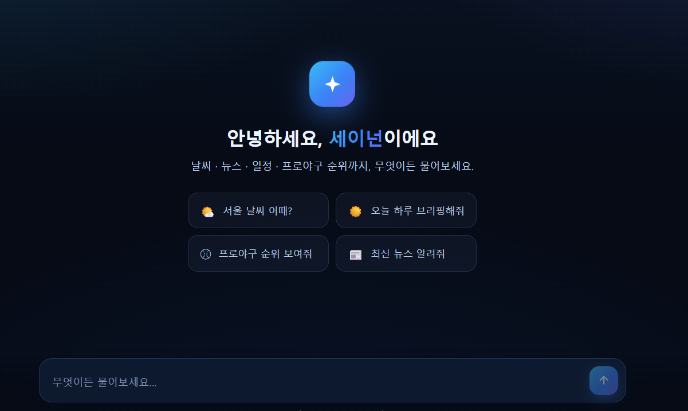

# MCP Agent Project

## 개요



MCP 서버를 이용해 도구를 호출하는 에이전트입니다. 사용자의 채팅 메시지를 받아 에이전트가 상황에 맞는 도구를 스스로 선택해서 실행하고, 결과를 스트리밍으로 응답합니다.

### 사용 가능한 도구

| 도구 | 설명 |
|---|---|
| `scrape_page_text` | 웹페이지 텍스트 스크래핑 |
| `get_weather` | 도시명으로 현재 날씨 조회 |
| `get_news_headlines` | 구글 RSS 최신 뉴스 헤드라인 |
| `get_kbo_rank` | KBO 프로야구 실시간 순위 |
| `today_schedule` | 구글 캘린더 오늘 일정 조회 |
| `daily_quote` | 오늘의 명언 생성 |
| `web_search_tavily` | Tavily 기반 실시간 웹 검색 |
| `brief_today` | 날씨/뉴스/일정/명언을 종합한 오늘의 브리핑 |

> **구글 캘린더(`today_schedule`, `brief_today`)는 반드시 본인의 Google 인증 토큰을 사용해야 합니다.** 배포자의 토큰이 아닌 사용자 개인의 구글 계정으로 인증해야 그 사람의 실제 일정이 조회되므로, 아래 절차대로 본인이 직접 OAuth 클라이언트를 발급받고 `google_auth.py`로 본인 계정 인증을 거쳐야 합니다.

## 셀프 배포

이 리포지토리는 **각자 자신의 API 키와 자신의 구글 계정으로 직접 배포해서 사용하는 구조**입니다. 즉, 아래 절차를 따라 fork/clone한 사람은 자기 자신의 OpenAI/Tavily 키, 자기 자신의 구글 캘린더로 동작하는 독립된 인스턴스를 갖게 됩니다.

## 1. 필요한 키 준비

### OpenAI API Key
https://platform.openai.com/api-keys 에서 발급.

### Tavily API Key
https://tavily.com 가입 후 대시보드에서 발급 (`tvly-...` 형태).

### Google Calendar OAuth 클라이언트 (credentials.json)
구글 캘린더 일정 조회 기능을 쓰려면 **본인 명의의 OAuth 클라이언트**를 직접 발급받아야 합니다.

1. [Google Cloud Console](https://console.cloud.google.com) 접속 → 새 프로젝트 생성
2. **APIs & Services → Library**에서 "Google Calendar API" 검색 후 활성화
3. **APIs & Services → OAuth consent screen** 설정 (User Type: External, 테스트 사용자로 본인 이메일 추가)
4. **APIs & Services → Credentials → Create Credentials → OAuth client ID**
   - Application type: **Desktop app**
5. 생성된 클라이언트의 JSON 파일을 다운로드하여 프로젝트 루트에 `credentials.json`으로 저장 (이 파일은 `.gitignore`에 포함되어 있어 커밋되지 않습니다)

## 2. 로컬 설정

```bash
git clone <이 리포 URL>
cd mcp_agent_project
uv sync
```

프로젝트 루트에 `.env` 파일 생성:
```
OPENAI_API_KEY=본인의_openai_키
TAVILY_API_KEY=본인의_tavily_키
```

구글 캘린더 최초 인증 (브라우저가 열리며 본인 구글 계정으로 로그인):
```bash
python google_auth.py
```
성공하면 `token.json`이 생성됩니다.

## 3. 로컬 실행 확인

```bash
python mcp_server.py      # 터미널 1: MCP 도구 서버 (8000)
python chat_agent.py      # 터미널 2: 채팅 에이전트 서버 (8001)
cd frontend && npm install && npm run dev   # 터미널 3: 프론트엔드 (5173)
```

## 4. Railway 배포

1. GitHub에 본인 계정으로 fork/push
2. [Railway](https://railway.app) → **New Project → Deploy from GitHub repo** → 이 리포 선택
   - `railway.json`에 정의된 Dockerfile 빌드가 자동으로 사용됩니다
3. **Variables** 탭에서 아래 값 등록:

   | 변수명 | 값 |
   |---|---|
   | `OPENAI_API_KEY` | 본인의 OpenAI 키 |
   | `TAVILY_API_KEY` | 본인의 Tavily 키 |
   | `GOOGLE_TOKEN_JSON` | 로컬에서 생성한 `token.json` 파일의 내용 전체 (그대로 복사/붙여넣기) |

   `PORT`는 Railway가 자동으로 주입하므로 별도 설정 불필요.
4. 배포 완료 후 **Settings → Networking → Generate Domain**으로 퍼블릭 URL 생성

## 아키텍처 메모

- `mcp_server.py` (내부 8000 포트)와 `chat_agent.py` (외부 노출 포트)가 한 컨테이너 안에서 `start.sh`로 함께 실행됩니다.
- 구글 캘린더 인증은 `google_auth.py`에서 `GOOGLE_TOKEN_JSON` 환경 변수(배포용) → `token.json` 파일(로컬) → `credentials.json` + 브라우저 흐름(로컬 최초 인증) 순으로 시도합니다.
- `credentials.json`, `token.json`, `.env`는 모두 `.gitignore`/`.dockerignore`에서 제외되어 있어 리포지토리에 절대 커밋되지 않습니다. 반드시 본인 로컬에서 발급/생성한 후 Railway Variables로만 전달하세요.

## 개선할 점

- 현재 대화 기록(체크포인터)은 `InMemorySaver`를 사용하고 있어, 서버가 재시작되면 모든 대화 세션이 사라집니다. Redis 등을 이용한 캐싱이나 별도 DB(Postgres 등) 기반 체크포인터로 교체하면 서버 재시작에도 대화가 유지되고, 다중 인스턴스로 스케일링할 때도 세션 상태를 공유할 수 있습니다.

## 🔗 데모

배포된 인스턴스를 바로 사용해볼 수 있습니다: **https://mcplanggraphagent-production.up.railway.app/**

> 이 데모는 배포자 본인의 API 키/구글 계정으로 동작합니다. 본인의 API 키와 구글 캘린더로 직접 써보고 싶다면 위 "셀프 배포" 절차를 따라 자신만의 인스턴스를 배포하세요.
